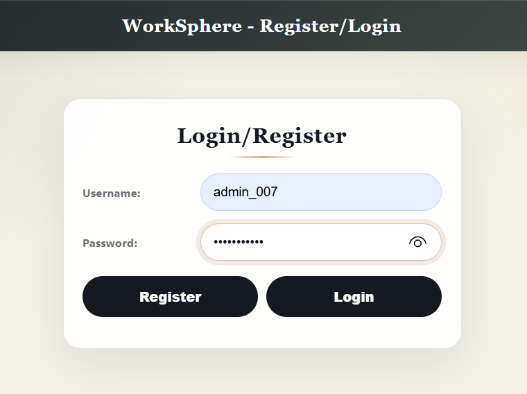
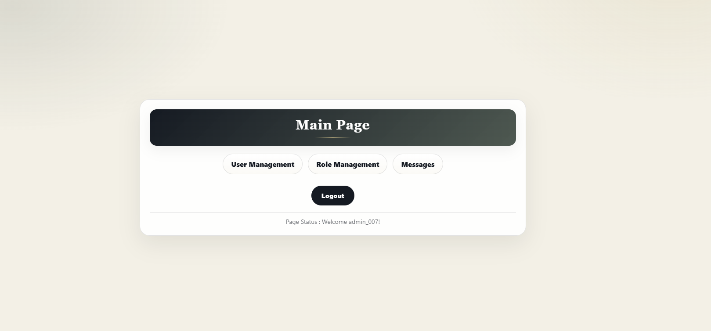
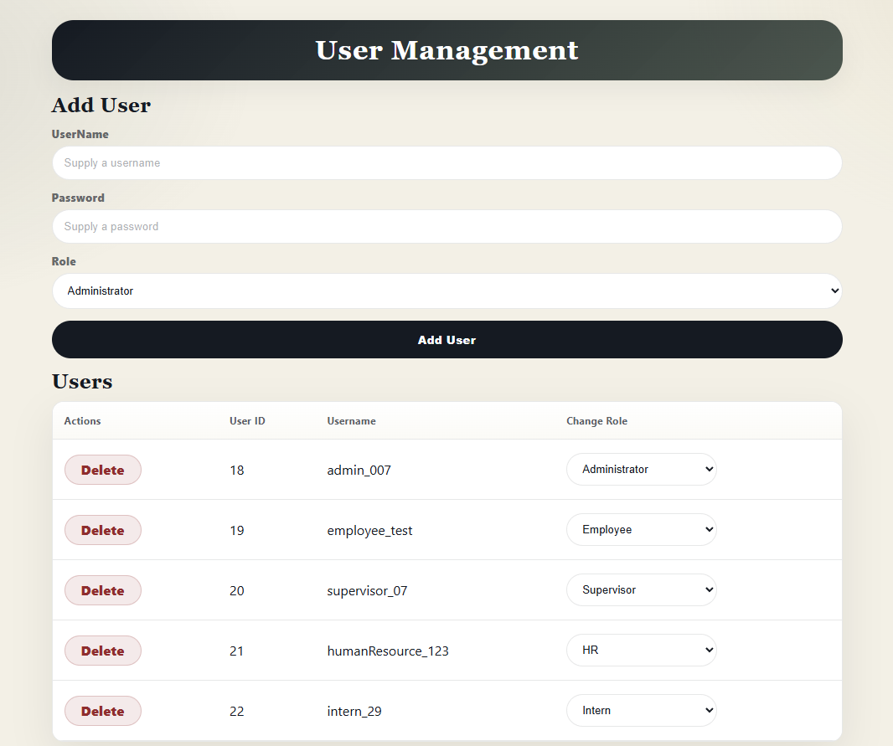
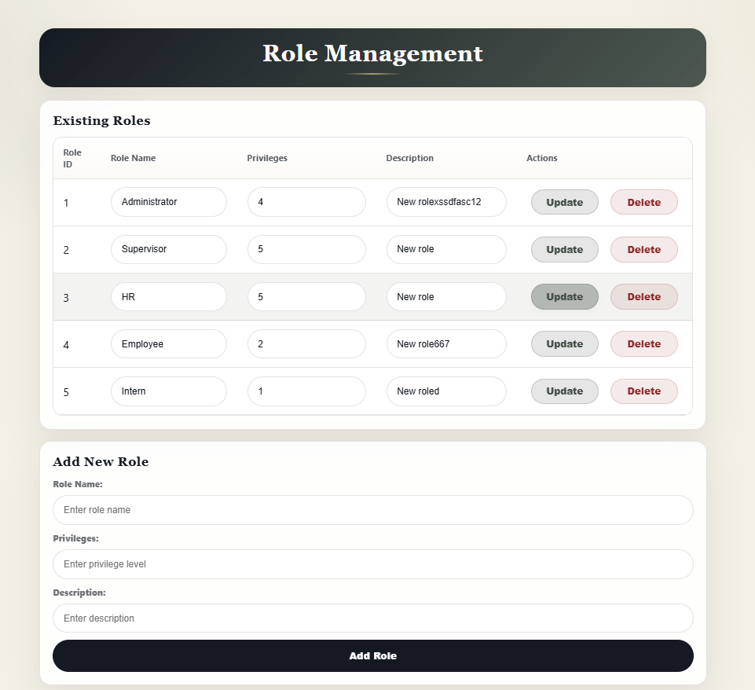
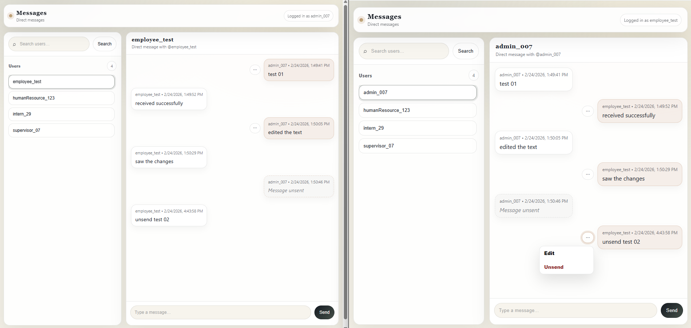

# 🚀 WorkSphere – Role-Based Employee Management & Real-Time Messaging System

WorkSphere is a full-stack web application built using **PHP, MySQL, AJAX, and jQuery** that implements secure authentication, role-based access control (RBAC), administrative management, and real-time direct messaging.

This project demonstrates structured backend architecture, privilege hierarchy enforcement, transaction-safe database operations, and asynchronous client-server communication.

---

## 📌 Project Overview

Many internal organizational systems lack proper:

- Secure authentication enforcement
- Role hierarchy validation
- Privilege escalation prevention
- Real-time internal communication

WorkSphere addresses these challenges by implementing a secure, structured, and scalable employee management platform with integrated messaging.

---

# 🏗 System Architecture

```
Client (Php / CSS / JS)
        ↓
AJAX (jQuery)
        ↓
PHP Backend (server.php / REST endpoints)
        ↓
MySQL Database
        ↓
Stored Procedures (Role Update / Role Delete)
```

---

# 🔐 Authentication & Security

- Password hashing using `password_hash()` (bcrypt)
- Password verification using `password_verify()`
- Session-based authentication (`$_SESSION`)
- Protected routes redirect unauthorized users
- Input sanitization using `strip_tags()` and `trim()`
- Role-based privilege validation
- Transaction rollback protection
- Stored procedure encapsulation for sensitive operations

---

# 👥 User Management Module

- Add new users with assigned roles
- Delete users securely
- Update user roles dynamically
- Privilege enforcement prevents assigning roles higher than your own rank
- AJAX-powered live table refresh

---

# 🛡 Role Management Module

- Create new roles
- Update role name, description, and privilege level
- Delete roles using stored procedures
- Prevent deletion of roles with assigned users
- Transaction-based database rollback for safety

---

# 💬 Real-Time Messaging Module

- Direct user-to-user communication
- Conversation-based Messenger-style layout
- Send messages asynchronously via AJAX
- Edit message functionality
- Unsend message functionality (marks as "message unsent")
- Polling-based near real-time refresh
- Session validation on all messaging endpoints

---

# 🗄 Database Schema

## users

| Field      | Type        | Description |
|------------|------------|-------------|
| user_id    | INT (PK)   | Unique user ID |
| username   | VARCHAR    | Unique username |
| password   | VARCHAR    | Hashed password |
| role_id    | INT (FK)   | Links to role_Info |

---

## role_Info

| Field        | Type        | Description |
|--------------|------------|-------------|
| role_id      | INT (PK)   | Role ID |
| role_name    | VARCHAR    | Role title |
| description  | TEXT       | Role description |
| role_value   | INT        | Privilege rank (higher = more privileges) |

---

## messages

| Field        | Type        | Description |
|--------------|------------|-------------|
| id   | INT (PK)   | Unique message ID |
| sender_id    | INT (FK)   | Sender user ID |
| recipient_id | INT (FK)   | Recipient user ID |
| message      | TEXT       | Message content |
| timestamp    | DATETIME   | Timestamp |

### Messaging Behavior

- Conversations are filtered by sender/recipient pair
- Editing updates message text
- Unsend replaces message content with `"message unsent"`
- All operations validated by active session

---

# 📂 Project Structure

```
WorkSphere/
│
├── assets/                  # Screenshots & media
├──directMessage/
        │
        ├── index.php            # Messaging UI (Messenger-style layout)
        ├── messages.js          # AJAX messaging logic
        ├── style.css            # Messaging UI styling
        │
        └── REST/
            ├── .htaccess        # URL routing
            ├── api.php          # REST entry point
            ├── apiDef.php       # REST controller class
            ├── dbUtil.php       # Messaging DB utilities
            └── error_log        # Server error logs
├── dbUtil.php               # Database utilities
├── server.php               # AJAX controller
├── login.php                # Authentication page
├── welcome.php              # Dashboard
├── userManage.php           # User management UI
├── roleManage.php           # Role management UI
├── deleteUser.php           # Protected delete endpoint
│
├── code.js                  # Frontend AJAX logic
├── style.css                # Login styling
├── userManage.css           # User UI styling
├── roleManage.css           # Role UI styling
├── styleWelcome.css         # Dashboard styling
│
└── README.md
```

---

# ⚙️ Installation & Setup

### 1️⃣ Clone the Repository

```bash
git clone https://github.com/your-username/WorkSphere.git
cd WorkSphere
```

### 2️⃣ Database Setup

1. Create a MySQL database
2. Create tables:
   - users
   - role_Info
   - messages
3. Add stored procedures:
   - UpdateRoleP
   - DeleteRole
4. Update database credentials inside `dbUtil.php`

---

### 3️⃣ Run the Application

- Install XAMPP / WAMP / MAMP
- Place project inside `htdocs`
- Open in browser:

```
http://localhost/WorkSphere/login.php
```

---

# 🖼 Screenshots

## 🔐 Login / Register


## 🏠 Main Dashboard


## 👥 User Management


## 🛡 Role Management


## 💬 Direct Messaging


---

# 🛠 Technologies Used

- PHP
- MySQL
- HTML5
- CSS3
- JavaScript
- jQuery
- AJAX
- Stored Procedures
- Session-Based Authentication
- RBAC Architecture

---

# 🚀 Key Highlights

✔ Enterprise-style RBAC privilege system  
✔ Prevents privilege escalation  
✔ Secure authentication with bcrypt hashing  
✔ Transaction-safe role deletion  
✔ Stored procedure integration  
✔ AJAX-powered dynamic interface  
✔ Real-time direct messaging system  

---

# 👨‍💻 Author

**Sandip Bohara Chhetri**  
Computer Engineering Technologist  
Full-Stack Development | Backend Architecture | Secure Systems  
